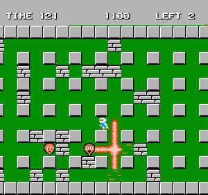

# Projeto Bomberman (NES)
### FPRO/MIEIC, 2019/20
### Pedro Gonçalo de Castro Correia up201905348@fe.up.pt
### 1MIEIC07 

#### Objetivo

Criar um clone do [Bomberman](https://www.retrogames.cz/play_085-NES.php) (NES) em Pygame

#### Descrição

É um jogo de estratégia onde o objetivo é destruir todos os inimigos presentes num labirinto.
O jogador pode movimentar-se ao longo desse labirinto e largar bombas, que explodem nas quatro
direções: cima, baixo, esquerda e direita. Estas bombas podem destruir determinados tipos de paredes
e podem matar o próprio jogador, se ele estiver na zona de explosão.

#### UI

### Pacotes

- Pygame

#### Tarefas

1. ~~**MATRIZ 13x13**~~
   1. ~~fazer cada objeto 50×50 (assim ficamos com uma resolução de 650x650)~~
      * ~~vazio (0)~~
      * ~~parede (1)~~
      * ~~caixas (2)~~
      * ~~caixa especial (3)~~
      * ~~porta (4) [aparece apenas depois da caixa especial explodir]~~
   1. ~~desenhar no ecrã~~
1. **JOGADOR**
   1. ~~desenhar jogador nas coordenadas dele~~
   1. teclas para movimentar
1. **BOMBA**
   1. duas listas: posição bombas, tempos bombas
   1. quando algum tempo for menor que 0, dentro dum `raio_bomba=3`:
      1. se for caixa, desaparece
      1. se for caixa especial, mostra porta
      1. caso contrário, adiciona uma chama (flame)
         * as chamas são controladas por duas listas: posição e tempos chamas (flames)
   1. desenhar chamas
   1. se jogador toca na chama, perde vida e volta à posição inicial
   1. se jogador toca na porta, avança nível
1. **INIMIGOS**
   1. duas lista: posições e direcções
   1. desenhar
   1. movimentar na direcção respectiva
   1. colisão entre jogador/inimigo e chama/inimigo
1. **DOIS JOGADORES**
1. **ANIMAÇÕES**

18 November 2019
